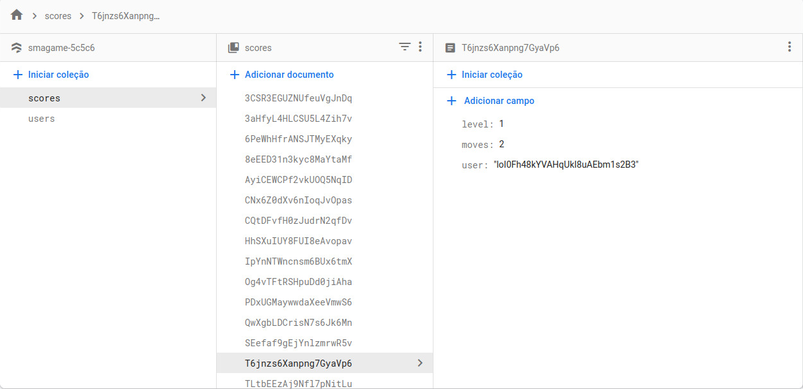

# Powerplant ⚡ - Mobile App 
    A mobile game in which the player has to rotate the energy pipes to provide energy for all the houses.
    This app was developed in Java with the Android Studio IDE.
    It's integrated with Firebase to allow users to sign in and keep track of their scores.

## Take a look!

## Want to play your custom level?
    You can edit 'src/main/res/raw/levels.txt' and create your own level!

